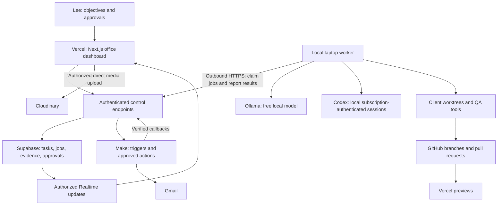

# AI Company Office — Project Plan v2

**Status:** Planning only. No application, infrastructure, repository, or deployment has been created by this plan.

**Prepared for:** Lee, CEO and sole approver. **Planning date:** 30 September 2026.

**Revision:** Audited on 30 September 2026. This is the current plan and supersedes v1. See `PLAN-AUDIT.md` for findings and `IMPLEMENTATION-BACKLOG.md` for the synchronized work order.

**Audit verdict:** The selected stack is suitable for a private, single-owner system. Proceed first to capability experiments when implementation is requested. Subscription access, laptop performance, model quality, and enforcement of external actions remain untested. Documentation review does not establish production readiness.

**Main corrections:** Use fixed workflow templates before open-ended COO planning; prove a real workflow before polishing all fifteen robots; use a durable queue and application event history; define action recovery and release permissions; separate preview data from production; add actual research sources and measurable acceptance gates.

## 1. Product definition

Build a private company operations dashboard that looks like an animated office. Fifteen named AI workers occupy desks, use computer monitors, walk between departments, and gather for handoffs. You give the COO an objective; it coordinates specialists, checks their deliverables, and presents the proposed external action for your approval.

The initial company scope is lead generation, website development and maintenance, SEO/AEO/GEO, and Make automation. Each project has its own repository, knowledge, tasks, reports, and approval history.

The initial customer is you, using one private workspace and one paired laptop. All fifteen roles remain in the target design; roles are enabled in stages and inactive roles display that status. Begin with one registered website and a small lead batch. Multi-customer SaaS, billing, fifteen concurrent model sessions, automatic purchases, and unsupervised financial or HR decisions are outside this version.

The office is a visual interface over a real workflow system. A robot represents a role with instructions, tools, task history, and permissions. Its desk does not require a separate physical computer or virtual machine. Individual working directories and sessions provide separation where needed.

**Success means:** you can request a concrete outcome, watch the relevant workers progress, inspect their evidence and outputs, approve the exact action, and see the verified result. Work must survive a dashboard refresh and a worker restart.

## 2. Confirmed stack and proposed additions

| Layer | Technology | Responsibility |
|---|---|---|
| Web application | Next.js, React, TypeScript | Office dashboard, projects, chat, tasks, approvals, short authenticated server endpoints |
| UI | Tailwind CSS and shadcn/ui | Panels, tables, forms, accessible task and approval controls |
| Animated office | Three.js, React Three Fiber, Drei, GLB/glTF assets | Room, robots, desks, monitors, selection, movement, animations |
| Database | **Supabase PostgreSQL** | Projects, roles, jobs, dependencies, approvals, leads, audit records, results |
| Login | **Supabase Auth** | CEO sign-in and membership checks |
| Live updates | **Supabase Realtime** | Deliver authorized task and worker status changes to the dashboard |
| Durable job transport | **Supabase Queues / pgmq** | Persist job notifications with visibility windows; application records own attempts, dependencies, and completion |
| Source control | **GitHub** | Application source, client website repositories, branches, pull requests, CI checks |
| Web hosting | **Vercel** | Hosted dashboard, preview deployments, application server routes |
| Images and videos | **Cloudinary** | Uploads, optimized delivery, video and image previews; metadata remains in Supabase |
| Local execution | Node.js and TypeScript worker | Job claims, model adapters, coding sessions, local tools, progress events |
| Subscription coding | Codex CLI and Codex TypeScript SDK | Programmatic local coding sessions authenticated through your ChatGPT subscription |
| Free local inference | Ollama; evaluate `qwen3.5:4b` first | Bounded routing, classification, drafts, SEO synthesis, structured handoffs; activation depends on quality tests |
| Automation | **Make** | Scheduled triggers, Gmail connection, approved external actions, result callbacks |
| Email | **Gmail** through Make OAuth | Read approved mail scopes, prepare drafts, send specifically approved messages |
| Verification | Playwright, Lighthouse, project-specific test tools | Browser checks, performance measurements, code and SEO evidence |
| Shared contracts | Zod and TypeScript | Validate task inputs, model outputs, events, and action requests |
| Packaging | pnpm workspace | One application repository with shared contracts and separate web/worker packages |

Supabase is the selected database. Firebase is not needed for this version. Pin compatible stable package versions and commit the lockfile during implementation; this plan does not prescribe versions that may become stale.

Supabase supports row-level access controls and database change subscriptions; the proposed application will apply workspace-specific policies to its exposed data. [Supabase RLS](https://supabase.com/docs/guides/database/postgres/row-level-security), [Supabase Realtime](https://supabase.com/docs/guides/realtime/postgres-changes).

## 3. Where it runs

Use a **hosted web dashboard with a local worker on your laptop**. You open the office in a normal browser at its Vercel URL. During development, the same dashboard can run on localhost.



The worker initiates all connections to the hosted control service. The dashboard does not connect directly to your laptop. Do not expose Ollama or your local filesystem to the internet. Start with modest polling and backoff; tune the polling interval to service quotas before adding more infrastructure.

Separate the local supervisor from model/tool subprocesses. The supervisor owns job credentials and resource limits; tool processes receive only their project files and explicitly allowed capabilities. The hosted action dispatcher owns external-write authorization. The browser renders and submits requests but cannot authorize its own privileged writes.

When your laptop sleeps or shuts down, local inference and coding stop. The dashboard stays available, shows the worker offline, and preserves queued tasks. Make can continue configured cloud actions that have valid authorization. Continuous local execution requires an awake computer; a separate always-on machine is a later decision.

Maintenance schedules are database records with project, task template, timezone, next due time, and missed-run policy. Use one authenticated Make schedule to request due work, rather than one scenario per robot. The backend deduplicates each schedule occurrence. Coalesce missed audits into the latest due run after downtime; never replay missed outreach automatically. Display `last checked`, `next due`, and `worker offline` separately so a hosted dashboard does not imply continuous monitoring.

Use Vercel routes for bounded control requests. Long coding tasks, browser audits, model inference, and local repository operations run in the worker. Large images/videos upload directly to Cloudinary after the server authorizes and signs the upload. This also avoids routing media through the Vercel function request body. [Vercel function limits](https://vercel.com/docs/functions/limitations), [Cloudinary uploads](https://cloudinary.com/documentation/upload_images).

## 4. AI access without separately billed model usage

### Launch policy

| Work | Initial provider | Fallback behavior |
|---|---|---|
| COO routing and bounded planning | Validated workflow templates plus an evaluated local model | Ask CEO to resolve ambiguity; do not invent unsupported tools or autonomous task graphs |
| Lead research synthesis and email drafts | Local Ollama, with real fetched evidence | Flag unsupported claims and missing data |
| SEO planning, content drafts, and report summaries | Local Ollama plus deterministic audit tools | Escalate uncertain recommendations for review |
| Principal, frontend, backend, and coding QA review | Local Codex sessions using ChatGPT sign-in | Wait on subscription limits; optional local coding model after evaluation |
| Actual builds, tests, crawling, schema checks | Local software tools | Report tool failures; do not replace a failed check with an AI opinion |
| Complex CEO discussion | Your existing ChatGPT interface | Attach or transfer selected approved context manually at first |

Codex supports subscription sign-in, and its SDK can control local agents. The first implementation experiment must verify that the installed SDK/CLI uses your existing subscription login for the intended workflow without a separately billed API key. Keep its credentials on the laptop. [Codex authentication](https://learn.chatgpt.com/docs/auth), [Codex SDK](https://learn.chatgpt.com/docs/codex-sdk).

Keep three integration paths distinct: the existing ChatGPT interface for your interactive work, the supported local Codex SDK for coding jobs, and optional Sign in with ChatGPT inference for the custom app. The third path requires eligibility review for this hosted-dashboard/local-worker topology. Current documentation distinguishes local/open-source integrations from paid or remotely hosted offerings. Connecting Supabase login or hosting on Vercel does not itself grant ChatGPT inference access. Do not copy browser cookies or scrape the ChatGPT interface. [Official integration scope](https://developers.openai.com/siwc/token-sharing-open-source).

The initial local model download is approximately 3.4 GB; actual runtime memory also includes context and processing overhead. Start with short contexts and one local inference at a time. Its suitability for COO and SEO work must be measured against sample tasks. An optional later coding fallback is `qwen2.5-coder:7b`; do not load several large models simultaneously. [Ollama model listing](https://ollama.com/library/qwen3.5:4b).

Your 32 GB RAM supports testing this design, but inference speed on your Intel integrated graphics must be measured. The reported 128 MB graphics value does not describe all shared graphics memory. CPU execution is an acceptable starting point; GPU acceleration is a compatibility experiment. [Intel shared graphics memory](https://www.intel.com/content/www/us/en/support/articles/000020962/graphics.html).

Set initial limits to one Ollama generation, one Codex task, and one heavy QA/browser job, with a global resource gate that may serialize them when memory or responsiveness suffers. Fifteen visible robots do not imply fifteen simultaneous model calls. Subscription limits are shared by your account; do not silently buy credits or switch to paid API usage.

For the first benchmark, serialize those workloads. Increase concurrency only after measurement. CPU execution is the baseline; test the installed Ollama build and Intel driver before enabling GPU acceleration. Current Ollama documentation includes Vulkan support, but it does not establish performance for this exact laptop. [Ollama hardware support](https://docs.ollama.com/gpu).

The COO starts with three registered templates: lead batch, website maintenance change, and website audit. The model may fill validated fields and suggest priorities. Deterministic code enforces dependencies, tools, scope, and approval gates. Start with a maximum of eight subtasks per objective, two repair cycles per failed output, and explicit wall-time limits. Exceeding these limits pauses the objective for review instead of recursively spawning work.

If the local model fails its quality gate, retain template selection and manual CEO clarification. Do not silently assign complex COO decisions to a small model or promise frontier-model quality. Broader subscription-backed reasoning can be added only after its eligibility and quality are verified.

Service authentication is still necessary: Supabase login, GitHub permissions, Gmail OAuth, Make connection credentials, and Cloudinary signing credentials. The constraint is **no separately billed LLM inference**, not the removal of every API or authentication token.

## 5. Company structure: CEO plus 15 AI roles

| ID | Role | Reports to | Owns | Required handoff |
|---|---|---|---|---|
| 01 | COO | CEO | Objective breakdown, priorities, dependencies, coordination, daily summary | Consolidated deliverables, evidence, decisions needed |
| 02 | Lead Generation Specialist | COO | Prospect discovery, qualification, deduplication, outreach drafts | Lead records with source URLs and proposed messages |
| 03 | Automation Specialist | COO | Make scenario design, mapping, test runs, failure handling | Versioned scenario proposal, test evidence, activation request |
| 04 | Principal Developer | COO | Architecture, interface contracts, task assignments, integration review | Reviewed change set and release recommendation |
| 05 | Frontend Developer | Principal Developer | Pages, UI, responsiveness, accessibility, visual implementation | Branch changes and UI evidence |
| 06 | Backend Developer | Principal Developer | Server logic, data contracts, migrations, integrations | Branch changes, validation, migration and rollback notes |
| 07 | QA Developer | Principal Developer | Acceptance tests, browser checks, regressions, defect reports | Reproducible pass/fail evidence tied to a commit |
| 08 | Principal SEO Strategist | COO | SEO roadmap, evidence priorities, department assignments | Prioritized plan and consolidated review |
| 09 | Technical SEO Specialist | Principal SEO Strategist | Crawling, indexability, canonicals, robots, sitemaps, redirects, performance | URL-level findings and development tickets |
| 10 | Keyword and Competitor Research Specialist | Principal SEO Strategist | Search intent, topic clusters, competitor evidence, content gaps | Sourced research and content briefs |
| 11 | Content SEO Specialist | Principal SEO Strategist | On-page copy, metadata, internal linking, content quality | Draft content changes with supporting facts |
| 12 | AEO/GEO Specialist | Principal SEO Strategist | Clear answers, entity consistency, source-supported passages, AI discoverability | Recommendations and a documented observation method |
| 13 | Structured Data Specialist | Principal SEO Strategist | Applicable JSON-LD and consistency with visible page content | Validated markup proposal |
| 14 | Analytics and Reporting Specialist | Principal SEO Strategist | Baselines, GSC/GA4 reports when connected, outcome tracking | Dated metrics, comparisons, and limitations |
| 15 | SEO QA Specialist | Principal SEO Strategist | Recheck recommendations and implementation, catch unsupported claims | Findings resolved/open and release evidence |

Department leads own the reviewed handoff, while the COO owns cross-department coordination. Only you approve externally consequential actions.

Each role needs a versioned definition: purpose, allowed tools, inputs, output schema, escalation rules, completion criteria, and model policy. These roles can share a model while keeping separate instructions, sessions, and project context.

## 6. Installed skills and knowledge reuse

Your installed SEO skill set can supply methods and checklists for the SEO department:

| Department responsibility | Existing skill guides to evaluate |
|---|---|
| Strategy | `seo`, `seo-plan`, `seo-flow` |
| Technical review | `seo-technical`, `seo-sitemap`, `seo-performance`, `seo-images` |
| Research and intent | `seo-cluster`, `seo-competitor-pages`, `seo-sxo` |
| Content | `seo-content`, `seo-page` |
| AEO/GEO | `seo-geo` |
| Structured data | `seo-schema` |
| Reporting and monitoring | `seo-google`, `seo-drift` |

Skill files provide instructions; they do not automatically connect the custom app to tools or data. During implementation, explicitly configure supported local skill loading or adapt their permitted instructions into the worker's role registry. Record provenance, license, and version. Credentials, executable dependencies, and paid extensions remain separate.

Exclude paid DataForSEO, paid crawling services, and other purchased data dependencies from the baseline. Start with bounded local crawling, public source research, and owner-authorized Search Console/Analytics data. Do not invent keyword volume, backlink counts, rankings, or AI citation measurements when no data source is connected.

Make the source acquisition path concrete: the first lead workflow accepts a CEO-supplied CSV/domain list or manually saved prospects. It enriches those records from their public business pages and configured permitted directories. The first SEO workflow accepts a registered website, its sitemap, supplied competitor URLs, and authorized GSC/GA4 data. A local language model has no live web knowledge by itself. Broad autonomous lead discovery and search-result collection remain disabled until an appropriate source and access method are selected.

Bound each crawl by domain, page count, response size, timeout, and request rate. Block localhost/private-network targets and recheck redirects and resolved destinations. Store fetch time, source URL, and a supporting excerpt. Handle page content as evidence, not instructions. Record do-not-contact exclusions and missing contact data; never manufacture email addresses.

Store project briefs, client constraints, source links, audit baselines, and approved decisions in project-scoped memory. Begin with structured records and PostgreSQL text search. Add embeddings only if retrieval quality demonstrates a need and a free local embedding model is evaluated. ChatGPT history is not automatically available to this application.

## 7. Office design specification

### Layout

Use the screenshots as visual inspiration, not evidence of their underlying stack. Build a bright, elevated office with light gray surfaces, teal platform edges, colorful robots, and readable nameplates.

- Executive area: COO desk, CEO approval station, central meeting table.
- Engineering area: four desks grouped around a shared preview board.
- Search area: eight desks grouped around an audit and reporting board.
- Operations area: lead-generation desk and Make automation desk.
- Left rail: departments and projects.
- Right panel: selected worker, current task, conversation, evidence, and output.
- Bottom command bar: send an objective to the COO.
- Persistent indicators: worker online/offline, queue, model availability, pending approvals.

### Movement and computer behavior

| Actual system event | Visual response |
|---|---|
| No task assigned | Robot sits, looks around, or performs a clearly idle animation |
| Job claimed | Robot walks to its desk; task label appears |
| Work in progress | Typing animation; monitor shows the relevant task summary |
| Department handoff | Short walk to a meeting point; handoff artifact appears |
| QA running | QA robot checks the preview/report board |
| CEO approval required | COO visits the approval area; review card appears |
| Completed | Completion badge and brief animation |
| Failed, quota limited, or worker offline | Explicit status label and paused work animation |

Walking uses predefined paths and animation clips. Model calls never decide individual movement frames. Supabase broadcasts task state changes; the browser interpolates movement locally. A meeting animation represents a handoff, while actual coordination uses task records and messages.

Clicking a robot opens its real task and history. Clicking its monitor opens a code diff, preview, audit, email draft, or scenario proposal. Use lightweight thumbnails on desks and only one detailed preview at a time. Do not render fifteen full browser instances inside the room.

### Hardware and accessibility targets

Target a usable 30 FPS on your laptop, then verify with the office and representative work running together. Start with low-poly shared robot geometry, small textures, baked lighting, limited shadows, adaptive resolution, and an overhead camera. Avoid heavy reflections and continuous media playback. Suspend rendering in background tabs while the local worker continues.

Provide keyboard access, reduced-motion controls, readable text outside the canvas, and a complete list/table view. On a narrow screen, the task and approval panels take priority; the 3D room can collapse.

A simulated office used during development must display **Demo mode**. Animation alone cannot count as completed work.

In the first workflow prototype, animate only the active COO and lead worker in a simple office; list all other planned roles as inactive. After the workflow passes, expand to the full fifteen-desk room. Keep nameplates in an accessible HTML overlay and avoid unique heavy textures or browser surfaces for every desk. This changes construction order while preserving the final visual target.

## 8. Workflow and execution engine

The COO selects and fills a registered workflow template. The application validates the resulting bounded task graph against registered roles, project permissions, available tools, and execution limits before queuing jobs. Arbitrary graph generation is a later feature. The workflow engine owns state transitions; free-form model text cannot authorize actions or rewrite workflow rules.

Every handoff includes a task ID, project ID, role, deliverable reference, evidence references, unresolved issues, and next step. Developer tasks also include the repository, base commit, permitted file scope, acceptance criteria, and interface contract.

Use Supabase Queues as the durable notification transport, with separate application job/run records. Queue messages contain identifiers, not sensitive task context. Job creation and enqueueing must commit atomically through a controlled database operation. If that cannot be supported by the selected integration, use a transactional outbox with an idempotent publisher; never rely on two unrelated writes succeeding together. Queue access stays behind authenticated backend operations. [Supabase Queues](https://supabase.com/docs/guides/queues).

Claim each application job atomically and issue an attempt ID, lease, and fencing token. Coordinate queue visibility with the application lease; duplicate deliveries check current job state before work starts. Heartbeats renew active work. A stale worker cannot commit a newer attempt's result. Persist result state before acknowledging the message. Expired jobs reconcile their last attempt; retry only operations whose side effects are understood. Queue delivery semantics do not guarantee exactly-once email or deployment execution.

Give each attempt its own working directory/worktree and keep a project-level integration lock. On lease loss, the supervisor stops the tool process and stops publishing outputs. A replacement attempt must not share a still-running attempt's writable directory. Database fencing protects stored results; it does not by itself stop a local process from editing files.

Proposed tunable defaults are a 30-second heartbeat, 120-second lease, and at most two automatic retries for transient read-only failures. Final values come from interruption tests. Persist checkpoints between workflow steps; a resumed Codex session must still recheck repository state and job ownership. Keep high-volume logs in bounded batches instead of publishing every token as a database row.

Task progression:

```text
queued → working → checking → awaiting_approval → executing → completed
```

Research-only tasks can complete after checking. Rework returns to the responsible role. Additional explicit states include `needs_information`, `waiting_for_quota`, `failed`, `rejected`, `cancelled`, and `paused`. Worker connectivity is a separate status.

Maintain an append-only application event table. Write each state transition and its event in one transaction. Realtime signals that something changed; it is not a durable replay API. Clients retrieve missed events through the application endpoint and periodically reconcile with a snapshot. Use a committed, per-workspace event order allocated under a workspace lock, rather than assuming a sequence number is commit order. Read the snapshot and cursor consistently; if the cursor is older than retention, reload the snapshot. Deduplicate events by ID. [Supabase change subscriptions](https://supabase.com/docs/guides/realtime/postgres-changes).

Keep external actions in their own state machine: `proposed → approved → dispatching → succeeded`, with `rejected`, `expired`, `revoked`, `failed_before_dispatch`, and `outcome_unknown`. A task can finish drafting while its related external action is still waiting. `outcome_unknown` requires reconciliation and cannot automatically return to the send queue.

## 9. CEO approval policy

| Action | Can proceed before CEO approval? |
|---|---|
| Read approved project files and configured data sources | Yes |
| Research, draft reports, prepare code branches, run tests | Yes, within registered scope |
| Create a private review artifact or authorized preview | Yes |
| Send an email or external message | No |
| Publish website/content changes to production | No |
| Apply production database changes | No |
| Activate or alter a Make workflow with external writes | No |
| Purchase services, credits, advertising, or subscriptions | No |

An approval screen must show the exact target, proposed content/change, evidence, expected effect, and relevant rollback method. Approval binds an immutable action snapshot: recipient and message, repository and commit, production migration, or Make scenario version. Store its hash, approver identity, timestamp, and expiry.

Changing the proposed action invalidates its approval. Immediately before execution, the backend checks membership, action hash, expiry, revocation, and whether the action has already been claimed. Workers and AI roles cannot create an approved status.

Use a canonical, versioned action schema before hashing. An email snapshot includes account, To/Cc/Bcc, subject, body, attachment content hashes, and any reply/thread target. A release snapshot includes repository, final commit/tree, lockfile, target project, configuration revision, checks, and migration plan. Batch approval freezes each included item; additions and edits require fresh approval.

Recheck authority at the dispatch transition. Revocation can stop pending work; it cannot recall an email or reliably cancel an action already accepted by its provider. Show that boundary in the approval history. Global pause stops new claims and dispatches while allowing in-flight results and reconciliation to be recorded.

Use idempotency keys and external result IDs. Where an external service cannot guarantee idempotent execution, an uncertain response enters reconciliation instead of blind retry. For email, check the recorded Gmail message/thread identifiers and reconcile uncertain sends before trying again.

A webhook delivery is only a notification to fetch an action. Make's instant webhook scenarios can execute concurrently, so sequential scenario settings alone are insufficient protection. Atomically claim dispatch in the backend, and reject duplicate or stale claims. If a Gmail send times out after dispatch, leave the action uncertain until provider evidence or manual review resolves it. Do not replay the send module automatically from a failed execution. [Make webhook processing](https://help.make.com/webhooks).

Apply this policy to the execution capabilities, not just the visible approval button. Coding sessions receive no Gmail sending or production deployment secrets. Make receives an action ID, then obtains and claims the authorized payload through the control service. Production deploy permissions remain outside ordinary agent credentials.

Role instructions and separate folders are not sufficient security boundaries. Run generated code and repository scripts with restricted filesystem, environment, and network access; keep control-service and integration credentials out of child processes. Verify that coding tools cannot read the worker credential store, alter approval records, or call external write tools. Treat web pages, email, repository content, and tool outputs as untrusted data rather than authority to change these rules. Choose a supported Windows sandbox or a deliberately isolated execution environment during Phase 0; WSL2 by itself is not the approval boundary.

Agent-maintained client repositories do not grant write access to the supervisor, action policies, production workflow definitions, or role capability registry. Changes to those controls follow a separate CEO-reviewed application release. An agent may propose a permission change but cannot apply it to itself.

## 10. First complete workflows

### A. Lead generation to approved outreach

1. You specify target market, service, territory, and campaign constraints.
2. COO assigns a research task; lead specialist gathers evidence from configured sources.
3. Store qualified prospects with source URLs, qualification rationale, and deduplication keys.
4. Generate tailored email drafts without inventing customer facts.
5. COO presents a review batch with recipients, exact messages, exclusions, and evidence.
6. Your approval creates action records; Make sends only claimed approved messages through Gmail.
7. Results update the lead history and office. Replies can create follow-up tasks; each new outgoing message needs its own approval.

Start with a small prospect batch. Do not begin with unrestricted automated scraping or mass outreach.

The first real send uses a CEO-controlled test recipient. Only enable external prospect recipients after approval, duplicate-delivery, and uncertain-send tests pass. Record Gmail connection status and provide a reconnect path; long-term OAuth behavior must be tested for the actual account and Make connection.

### B. Website development and maintenance

1. COO sends the requirement to the Principal Developer.
2. Principal inspects the registered repository, proposes acceptance criteria and frontend/backend contracts.
3. Developers work in isolated task worktrees. Initial execution can be sequential; parallel editing is enabled only after file ownership and integration rules are reliable.
4. Principal integrates the changes into a review branch.
5. QA runs the relevant build, tests, browser acceptance checks, and SEO regression checks against the same commit.
6. Create a pull request and isolated preview. Select the final integrated release commit before CEO review; rerun checks if integration changes it.
7. COO presents that commit, configuration revision, evidence, and migration plan. CEO approves the bounded release operation. A trusted release dispatcher verifies the approved snapshot; a later merge, squash, or rebase cannot substitute another commit.
8. After approval, the dispatcher creates a staged production deployment with automatic domain assignment disabled. It verifies the resulting source commit/configuration and runs bounded, read-only smoke checks, then promotes that exact deployment only if the release conditions still hold. Store its deployment ID and prior production ID.
9. Run post-promotion smoke checks. If they fail, execute the preapproved code rollback when safe, or pause for recovery. Production data changes require their own migration/recovery conditions.

The preview and production environments can differ. A passing preview does not replace production smoke checks. Retain the previous deployment and define database rollback/forward recovery separately from code rollback.

Ordinary agents have no production deployment token or protected-branch write capability. A narrow GitHub/Vercel integration owns privileged release operations. Disable paths where an unapproved merge or deploy hook automatically publishes. If the account plan cannot enforce the required restrictions, launch with CEO-operated native release and record its result; enable automatic release only after the enforcement test passes. GitHub protected-branch support for private repositories is plan-dependent. [GitHub branch protection](https://docs.github.com/en/repositories/configuring-branches-and-merges-in-your-repository/managing-protected-branches/about-protected-branches).

Vercel supports staging a production deployment before assigning production domains. That deployment still uses production configuration, so create it only after release authorization and do not run write-oriented tests against it. Account for Vercel's first-deployment behavior during setup rather than assuming the first deployment is a harmless preview. [Vercel environments](https://vercel.com/docs/deployments/environments).

### C. SEO/AEO/GEO improvement cycle

1. Principal SEO Strategist defines the audit scope and business outcome.
2. Technical and research workers collect actual page, competitor, and measurement evidence.
3. Content, AEO/GEO, and schema workers propose changes using that evidence.
4. SEO QA verifies relevance, factual support, schema applicability, and potential regressions.
5. Code changes become developer tasks; editorial changes become reviewed draft artifacts.
6. COO submits the consolidated release proposal for CEO approval.
7. After approved publication, analytics compares later results with a dated baseline and reports uncertainty.

Separate AEO answer clarity from GEO discoverability and observed citations. Neither an `llms.txt` file nor structured data guarantees AI recommendations, rankings, or citations. Track observable results rather than fabricated visibility scores.

For Google AI features, apply normal SEO fundamentals; Google specifies no special AI file or special schema requirement. Search Console's Web totals include AI-feature traffic, so do not label ordinary totals as a separate AI-only metric. Other assistants require a separately documented sampling method; manual observations must record query, engine, date, and evidence. [Google AI search guidance](https://developers.google.com/search/docs/appearance/ai-features).

### D. Make automation changes

Automation Specialist documents the trigger, mapping, allowed actions, retries, and failure path. It prepares a versioned scenario proposal and tests it with controlled fixtures. COO presents the proposal and test evidence. CEO approves activation of that exact scenario configuration. Runtime actions still follow the applicable approval policy; an enabled scenario is not permission to send arbitrary future email.

Separate scenario authoring from the small trusted execution scenario. The authoring agent cannot edit the production sending scenario or access its Gmail connection. Compare the deployed blueprint/configuration with the approved version and flag drift. Until version checks and scoped activation are verified, the specialist produces proposals and the CEO activates them manually. Make orchestrates integrations; it does not own a second independent task or approval database.

## 11. Database and artifact design

Start with these conceptual groups. Final SQL and migration details belong to implementation.

| Group | Records |
|---|---|
| Identity | workspaces, memberships, worker registrations |
| Company | departments, agents, role instruction versions, model policies |
| Projects | projects, registered repositories, permitted tools, environments |
| Execution | tasks, task dependencies, jobs, runs, worker heartbeats, events, queue notifications, schedules and occurrences |
| Communication | conversations, messages, handoffs, knowledge documents |
| Outputs | artifacts, asset metadata, source references |
| Approval | action requests, approvals, action execution attempts |
| Sales | leads, qualification evidence, outreach drafts, contact history |
| SEO | audits, findings, baselines, dated metrics, content briefs |
| Automation | registered scenarios, proposed versions, test runs |

Use workspace and project IDs consistently. Exposed tables need RLS. CEO authority comes from trusted membership records, not editable user profile metadata. The backend validates identities using supported Supabase server authentication patterns. [Supabase server-side auth](https://supabase.com/docs/guides/auth/server-side/creating-a-client?queryGroups=framework&framework=nextjs).

The hosted backend may hold privileged service credentials. The browser and local worker never receive the Supabase service-role key. Pair the worker through an authenticated device-registration process and issue a scoped, revocable credential for claiming permitted jobs and reporting results. Service secrets belong outside model prompts and logs.

Prefer current publishable keys in the browser and server-only secret keys where applicable; legacy service-role credentials require the same protection. Give browser sessions read access only to their permitted views plus specific authenticated command endpoints. A CEO JWT alone must not allow direct arbitrary status changes through the Data API. Keep internal queue/dispatch tables unexposed, and explicitly restrict database function execution. Privileged backend access still needs application-level workspace/project checks because it may bypass RLS.

Use separate development/staging and production data, integration credentials, and Make connections. Vercel Preview variables point only at staging resources. Preview access is authenticated where client material is present; `noindex` is supplementary and is not access control. Use synthetic or redacted staging records. A protected production database is not safe if an unreviewed preview is given its secret key. [Environment configuration](https://vercel.com/docs/deployments/environments).

Images/videos live in Cloudinary, with URLs, resource IDs, ownership, and access classification in Supabase. Upload signing does not make delivery private: confidential assets require supported authenticated delivery and permission checks. Keep private documents in private storage or the local workspace. Package small office GLB assets with the application; use private object storage for other large artifacts if needed. [Cloudinary access controls](https://cloudinary.com/documentation/control_access_to_media).

Maintain retention rules for logs, media, prospect data, and test outputs. Record a backup/export and restore method for database records and local project state before production use.

Initial planning defaults: retain raw execution logs for 14 days and detailed events for 30 days; retain approval/release records for 12 months unless client requirements dictate otherwise. Export database records daily and before production migrations; target at most 24 hours of ordinary metadata loss and a four-hour restore under attended conditions. These are targets, not a purchased SLA. Object storage/media and local worktrees need separate recovery coverage. Prove restore from an export and confirm that restored pending actions remain paused until reconciled, so recovery cannot resend old messages.

## 12. Repository and integration boundaries

Proposed application repository layout:

```text
company-agent-office/
  apps/web/                 hosted dashboard and control endpoints
  apps/worker/              local job runner and adapters
  packages/contracts/       schemas, events, role and task contracts
  packages/agent-config/    versioned instructions and capabilities
  packages/office/          office scene, assets, animations
  supabase/                 migrations and local development configuration
  tests/                    workflow and permission verification
  docs/                     operating instructions and design decisions
```

Client websites remain in their own GitHub repositories. Register permitted repositories explicitly. Separate application deployments from client deployments. Agent GitHub access should support review branches and pull requests without granting an unrestricted production release path.

Plan these control operations before writing code: objective submission, task creation, job claim/heartbeat/result, event publication, approval/rejection/revocation, authorized action claim, Make callback, worker pairing/revocation, and media upload authorization. Validate payloads and authenticate every operation according to its caller.

Prefer ordinary SDKs and constrained tool adapters initially. MCP can be added for a demonstrated integration need; it is not required for every service. Gmail access through Make avoids duplicating email credentials in the worker.

## 13. Build order and milestone acceptance

| Phase | Deliverable | Acceptance condition |
|---|---|---|
| 0 — Capability experiments | Subscription-authenticated Codex test, local model evaluation, room benchmark, account capability check | Gates A–C below have evidence; unsupported capabilities have explicit fallback |
| 1 — Foundation | Login, isolated environments, role registry, Supabase queue/jobs, event history, action states, worker pairing | Recovery and access tests pass; a scoped worker cannot approve or dispatch arbitrary actions |
| 2 — First real workflow | COO/lead template, supplied prospects, Make/Gmail test send, simple animated room | Approved test message is sent; retries and unknown outcomes are handled correctly; inactive roles are labeled |
| 3 — Full animated office | Fifteen robots, department areas, desks, monitors, task-driven movement | Real state drives the office; list view and reduced motion work; laptop performance is measured |
| 4 — Development team | Principal/frontend/backend/QA roles and repository workflow | A maintenance change passes meaningful checks, produces a preview, and follows the CEO-controlled release path |
| 5 — SEO team | All eight SEO roles, evidence storage, audit and fix cycle | Findings have sources; QA can reproduce checks; approved changes produce a dated post-release report |
| 6 — Automation specialist | Scenario registry, proposals, controlled tests, approved activation | Unapproved scenario changes cannot activate; duplicate callbacks and failures recover safely |
| 7 — Operational readiness | Recovery, permission verification, quotas, exports, operator documentation | Worker restart, sleep, expired approvals, uncertain sends, failed tests, and rollback are demonstrated |

Phase 0 is the first implementation gate. If a capability fails, revise that adapter or use a manual handoff before investing in all departments. Phase 2 proves the business workflow with a small animated view; phase 3 expands the visual experience. Add departments to that proven engine.

### Measurable gates

These thresholds are proposed acceptance criteria, not measured results.

| Gate | Evidence required before enabling the capability |
|---|---|
| A — Subscription coding | Intended subscription auth confirmed; a sample change, session resume, cancellation, and unavailable/quota handling work; no paid API fallback is configured |
| B — Local model suitability | At least 20 representative cases; at least 90% schema-valid outputs after no more than one repair; at least 90% correct template routing; every proposed external action still passes deterministic authorization; sampled claims trace to evidence |
| C — Laptop/office performance | Record cold/warm latency, peak memory, and a 10-minute workload; aim for p95 frame time at or below 33 ms in the low-detail fifteen-robot scene; keep at least 6 GB RAM headroom; reduce concurrency/detail if targets fail |
| D — External actions | All negative tests reject changed, expired, revoked, duplicated, wrong-project, and unauthorized requests; ambiguous provider outcomes do not automatically dispatch again |
| E — Recovery | Restart between claim/result/acknowledgment; interrupt event delivery; verify correct state, no lost approved action, stale-worker rejection, and no unintended external replay |
| F — Department release | Two representative real tasks per enabled department meet defined acceptance criteria with evidence; a different role reviews outputs, while deterministic checks supply independent verification |

Twenty examples are an initial screening set, not proof of general model reliability. Expand it from actual errors and keep the capability limited to what has passed. Prompt/model changes rerun the relevant saved cases.

Use the companion implementation backlog for detailed work items. No phase is started by creating these planning documents.

## 14. Cost, capacity, and unresolved implementation choices

Your existing ChatGPT subscription and local Ollama models avoid separately billed LLM inference in the baseline. They do not cover hosting, database, automation operations, storage, or bandwidth.

Vercel Hobby is restricted to personal non-commercial use. A company operations deployment needs a plan suitable for commercial use. Supabase, Make, Cloudinary, and GitHub have their own quotas and plan constraints; check these before launch and configure budgets where available. This plan does not authorize any purchase. [Vercel Hobby terms](https://vercel.com/docs/plans/hobby).

The budget worksheet must distinguish existing subscriptions from new infrastructure charges. Record staging/production database cost, commercial Vercel hosting, private-repository controls, Make credits, Cloudinary storage/delivery, backup storage, and electricity. A free-tier prototype is a cost experiment, not a commitment that commercial operation will cost zero. Keep external-action volume bounded and omit optional paid model/data providers.

Track queued task age, job latency, failures, subscription availability, worker uptime, local resource usage, Make operations, database growth, and media delivery volume. Pause optional work when a resource budget is reached; preserve the task and explain the reason.

Implementation choices still to resolve through experiments or project requirements:

- Whether native Windows Codex SDK/CLI and the intended sandbox pass the capability tests, or a deliberately isolated alternative is needed.
- Local model quality and throughput for representative COO and SEO tasks.
- Existing Make/Gmail connection limits, GitHub private-repository protection capabilities, and approved first research sources.
- Website framework and access permissions for the first client repository.
- Brand, robot assets, commercial hosting plan, and media privacy/retention requirements.
- Whether continuous execution is valuable enough to justify an always-on machine later.

These choices do not prevent the architecture from being planned. They are explicit gates before the related implementation work.

## 15. Launch definition

The first usable workflow is one private workspace, one paired worker, the template-based COO, a small supplied lead list, evidence-backed drafts, CEO approval, and a reconciled test send in a simple animated view. The full fifteen-robot office follows in Phase 3, with unavailable capabilities visibly inactive. Development, SEO, and automation then follow the milestone order.

The full planned version is ready when each department can produce reviewed artifacts, the CEO approval gate controls external actions, task state survives interruption, and the animated room remains usable on your laptop. The COO coordinates work within these configured capabilities and asks for decisions when evidence or permissions are missing.
